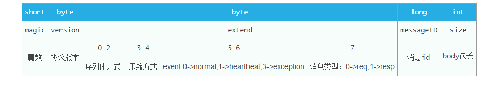

# Forest
[](https://github.com/dempeZheng/forest/blob/master/LICENSE)
[](https://travis-ci.org/dempeZheng/forest)

# Overview
基于netty轻量的高性能分布式RPC服务框架。简单，易用，高效。

# Features
- 服务端支持多种序列化方式：fastjson，hession，kryo
- 服务端支持多种压缩方式：gzip，snappy
- 服务端支持同时基于jersey暴露restful服务
- 支持注解配置，也支持spring xml配置
- 支持服务发现服务注册
- client端支持多种负载均衡策略和容灾策略
- client内置连接池
- client支持熔断，一个时间段错误次数达到一定阈值，自动熔断
- 基于netty 4.x版本实现，高性能（win 8cpu单机8w+）


# Protocol




# Quick Start


Add dependencies to pom.

``` xml
<dependency>
    <groupId>com.zhizus</groupId>
    <artifactId>forest-rpc</artifactId>
    <version>0.0.2</version>
</dependency>

<dependency>
    <groupId>com.zhizus</groupId>
    <artifactId>forest-common</artifactId>
    <version>0.0.2</version>
</dependency>
```


## 1.定义接口

>通过注解`@ServiceProvider`暴露服务，通过`@MethodProvider`暴露方法默认配置，如：`压缩方式，序列化方式，客户端超时时间`


``` java
@ServiceProvider(serviceName = "sampleService", haStrategyType = HaStrategyType.FAIL_FAST,
        loadBalanceType = LoadBalanceType.RANDOM, connectionTimeout = Constants.CONNECTION_TIMEOUT)
public interface SampleService {

    @MethodProvider(methodName = "say")
    String say(String str);

    @MethodProvider(methodName = "echo", serializeType = SerializeType.Hession2, compressType = CompressType.None)
    String echo(String msg);
}

 ```

## 2.实现接口

>基于注解`@ServiceExport`发布服务，基于注解 `@MethodExport`发布方法，

``` java
@Path("/sample")
@ServiceExport
public class SampleServiceImpl implements SampleService {

    /**
     * 支持jersey，可以通过配置打开，同时启动http服务
     *
     * @param str
     * @return
     */
    @Path("/hello/{str}")
    @GET
    @Produces("text/plain")
    @MethodExport
    @Rate(2)
    @Override
    public String say(@PathParam("str") String str) {
        return "say " + str;
    }

    @Interceptor("metricInterceptor")
    @MethodExport
    @Override
    public String echo(String msg) {
        return "echo>>> " + msg;
    }

}

```

## 3.服务端开发

### spring context 配置：

`application.xml`

```xml
<?xml version="1.0" encoding="UTF-8"?>
<beans xmlns:xsi="http://www.w3.org/2001/XMLSchema-instance"
       xmlns:context="http://www.springframework.org/schema/context"
       xmlns="http://www.springframework.org/schema/beans"
       xsi:schemaLocation="http://www.springframework.org/schema/beans
	http://www.springframework.org/schema/beans/spring-beans.xsd
	http://www.springframework.org/schema/context
	http://www.springframework.org/schema/context/spring-context.xsd">

    <context:component-scan base-package="com.zhizus.forest.demo"/>
   <bean id="forestServer" class="com.zhizus.forest.support.spring.ForestServerBean"/>

</beans>
```

### Server开发

``` java
public class SampleServer {
    public static void main(String[] args) throws Exception {
	new ClassPathXmlApplicationContext(new String[]{"application.xml"});
    }
}

```

## 4.客户端开发

```java
  final SampleService sampleService = Forest.from(SampleService.class);
        ExecutorService executorService = Executors.newCachedThreadPool();
        for (int i = 0; i < 20; i++) {
            executorService.submit(new Runnable() {
                @Override
                public void run() {
                    for (int i = 0; i < 1000000000; i++) {
                        String say = sampleService.echo("hello");
                        if (i % 10000 == 0) {
                            System.out.println(say);
                        }
                    }
                }
            });
        }
```

### Console输出

```
23:10:10.295 [pool-1-thread-1] INFO MetricInterceptor 34 - methodName:/sampleService/say, current tps:83342, avgTime:0, maxTime:63, minTime:0
23:10:11.298 [pool-1-thread-1] INFO MetricInterceptor 34 - methodName:/sampleService/say, current tps:86271, avgTime:0, maxTime:63, minTime:0
23:10:12.295 [pool-1-thread-1] INFO MetricInterceptor 34 - methodName:/sampleService/say, current tps:86063, avgTime:0, maxTime:63, minTime:0
23:10:13.295 [pool-1-thread-1] INFO MetricInterceptor 34 - methodName:/sampleService/say, current tps:84305, avgTime:0, maxTime:63, minTime:0
```

[更多示例](https://github.com/dempeZheng/forestRPC/tree/master/forest-demo)


# Documents

* [Wiki(中文)](https://github.com/dempeZheng/forest/wiki/zh_quick_start)

# TODO

- 跨语言协议支持
- 服务治理管理后台

# License

Forest is released under the [Apache License 2.0](http://www.apache.org/licenses/LICENSE-2.0).


